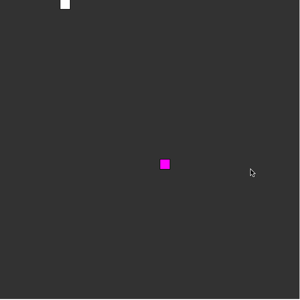

# Snake Game

Simple snake game developed by vanilla Javascript and p5js library.

## Demo

Small demo video below:



GIF created with [LiceCap](http://www.cockos.com/licecap/).
## Getting Started

This project is the part 2 of spring intensive, choosing a new language, framework or library and finish biginner level project.

### Prerequisites

No prerequisites.

### Installing

Clone the repo

```
git clone https://github.com/Sukhrobjon/snake-game-with-p5js.git
```

Go the directory

```
cd snake-game-with-p5js
open index.html
```

## Built With

* [Javascript](https://www.javascript.com/) - Language
* [p5.js](https://p5js.org/) - Javascript Library

## Authors

* **Sukhrobjon Golibboev** - *Initial work* - [Sukhrob](https://github.com/sukhrobjon)

## License

This project is licensed under the MIT License - see the [LICENSE.md](LICENSE.md) file for details

## Acknowledgments

* Readme template by - [Purple Booth](https://gist.github.com/PurpleBooth/109311bb0361f32d87a2)
* Inspiration - [The Coding Train](https://www.youtube.com/watch?v=AaGK-fj-BAM)
